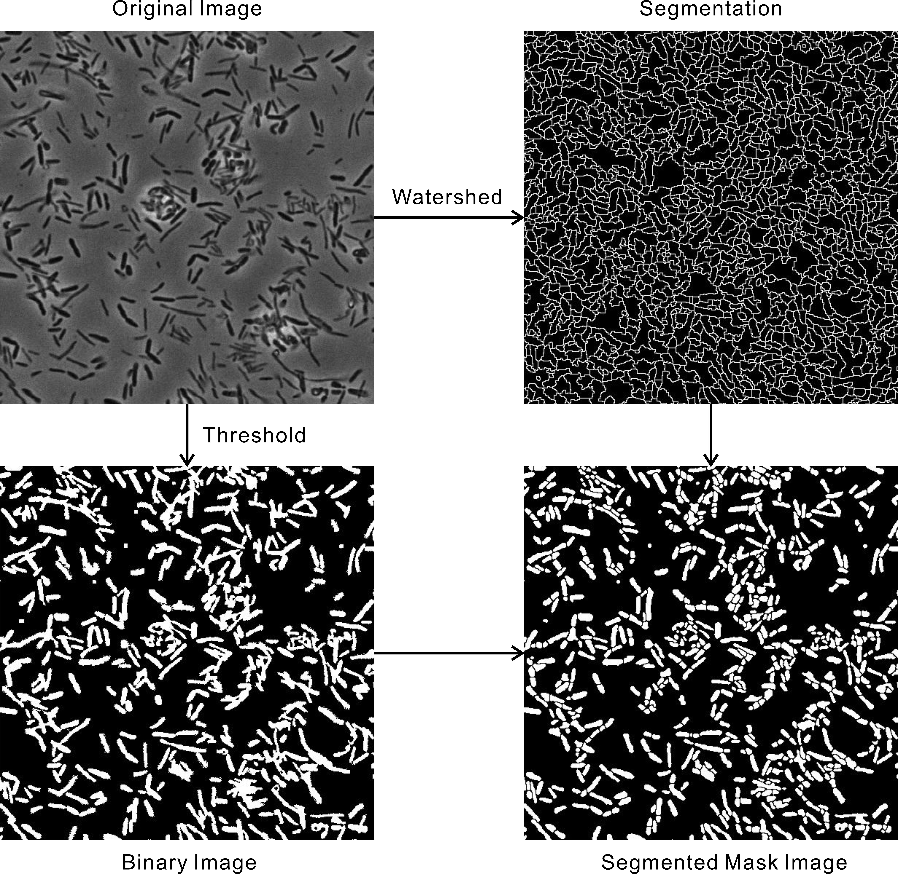
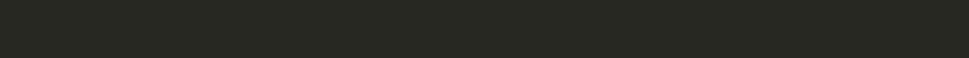

## Overview

This repo provide several demos of image analysis and simulation used in SEER-FISH. These functions can be used in images analysis for bacterial/microbiome community, FISH probe design, SEER-FISH simulation and other appropriate situations.

For image analysis, a submodule ```nd2reader``` is used for loading ```.nd2``` files captured by microscopy from Nikon. It is easy to modify the code for analyzing the images in other format such as ```.tif```.

For FISH probe design, we proved a prokka based script to extract the 16S and 23S sequence from WGS. We also proved a auto-submit script to calculated the Gibbs Free energy change during probe binding to corresponding rRNA on mathFISH. 

For simulation used in SEER-FISH, we used a ```MATLAB``` script to evaluate the F1 score when applying SEER-FISH with a specific set of rRNA probes based on the hybridization efficiency given by mathFISH.

For analysis of the sequencing data, we used botiwe2 to align the sequencing data with the reference sequence and extract the OTU table.

Thanks to @Junyu for his help on probe design.
Thanks to @Yuxiang for his help on amplicon sequencing data analysis.

## Cite As
1. Cao, Z., Zuo, W., Wang, L. et al. Spatial profiling of microbial communities by sequential FISH with error-robust encoding. Nat Commun 14, 1477 (2023). https://doi.org/10.1038/s41467-023-37188-3

## Image Analysis

### Image Alignment

Using the following commander to align multiple images in image stack ```Image```.

```matlab
[ImageAligned] = Alignment(Image)
```

The image stack will be aligned to the position with maximal cross correlation. The aligned image stack will be return as ```ImageAligned```.

To align other image stacks with the same position as ```Image```, you can use,
```matlab
[ImageAligned,Image2Aligned,Image3Aligned...] = Alignment(Image,Image2,Image3,..)
```

### Image Segmentation

To segment each bacterial cell in the image, you can use ```ImageSegment``` function. This function segment image based on auto threshold and watershed method. 

```matlab
[SegmentedBWImage] = ImageSegment(Image)
```




The ```Image``` input should be dark phase contrast image, i.e. bacteria cell is darker than the background. To segment fluorescent image, you can use the reversed image instead.

You can adjust the segmentation with Parameter as below. These parameters are defined in the table below.

```matlab
[SegmentedBWImage] = ImageSegment(Image, 'Parameter', value)
```

|      Parameters      	| Value                                                                                                                                    	|
|:--------------------:	|------------------------------------------------------------------------------------------------------------------------------------------	|
|     ```sePattern```     	| The pattern used in ```imerode``` and ```imdilate```. For example, ```strel('disk',1)```.                                                   	|
|     ```AreaRange```     	| The range of the area of the bacteria cells. The patterns with area out of range in the final segmented image will be dropped. For example ```[10,1000]```.                                                    	|
|     ```Threshold```     	| The threshold for generating the binary image. When ```Threshold``` is set as ```'Auto'```, the threshold will be generated according to the image. For example, ```'Auto'```, ```0.5```.                                                   	|
|     ```Effectiveness```     	| The effectiveness for auto threshold. If the auto threshold gives a effectiveness less than the given value, the image will be cut into several pieces to find a better threshold (See parameter ```N``` below). For example, ```0.65```.                                                   	|
|     ```N```     	| The image will be cut into ```N*N``` regions and the threshold for each region will be calculated. For example, ```10```.  

### Bacterial species Identify

First, the color of each bacteria cell will be identified according to the fluorescent image stacks of each channel.

```matlab
[CodexRes] = ColorIdentify(SegmentedBWImage,FITCImage,TRITCImage,CY5Image,Index)
```

You can also use ```ColorIdentify_Bright``` if you want to identify the color only by brightness of each channel.

```matlab
[CodexRes] = ColorIdentify_Bright(SegmentedBWImage,FITCImage,TRITCImage,CY5Image,Index)
```

Then the obtained code will be identified according to the codebook and bits of correction.

```matlab
[StrainLikehood,Decode] = StrainIndentify(StrainCode,CodexRes,CorrBit)
```

The following code could do the process faster.

```matlab
[StrainLikehood,Decode] = StrainIndentifySim(StrainCode,CodexRes,CorrBit)
```

### Labeled Image

The segmented images can be labeled according to the decode result.

```matlab
[StrainImageAll, StrainImage] = LabelImage(BW_Image_Segment, Decode)
```

Where ```StrainImageAll``` is the labeled image and ```StrainImage``` is the binary image of each strain. The unidentified strain is labeled as ```strainnum+1```.

### Pair Correlation Analysis

```PairCorrelation``` calculates the correlation of the bacteria in the images based on the the Linear Dipole Algorithm (Daims, H. & Wagner, M., 2011).

```matlab
[GR] = PairCorrelation(StrainImage1, StrainImage2, ScaleX, Range, varargin)
```

A mask can be used for the analysis by,

```matlab
[GR] = PairCorrelation(StrainImage1, StrainImage2, ScaleX, Range, 'Mask',Maskimage)
```
### Pair Association Analysis

You can calculate the pair association with the folloing code.

[...] = PairAssociation(CellInfoAll)

Here ```CellInfoAll``` should be a ```cell``` contains all cell informations on all roots (1:10 for control, 11:20 for perturbation 1 and 21:30 for perturbation 3). The cell info included the strain type and cell location on root.

### Process

```ProcessStep1```, ```ProcessStep2``` and ```ProcessStep3``` give an example code about process multiple region images of root.

### Demo

The ```Demo``` of image anaysis is given in ```Demo_ImageAnalysis.m```

Demo data is provided at [Zenodo](https://doi.org/10.5281/zenodo.5100490)

## Simulation

### MathFISH auto-submitter

This python script is used for submit probe and rRNA sequence to [mathFISH](http://mathfish.cee.wisc.edu/ "mathFISH") to calculate ΔG. 

You need to list the sequences of probes and rRNAs in separated ```txt``` files.

For example, ```ProbeSequence.txt``` 

```csv
1, ~sequence of the probe~
```

and ```rRNASeq.txt```

```csv
1, ~sequence of 16S rRNA~, ~sequence of 23S rRNA~
```

Then run the script below to calculate the ΔG between each probe in ```ProbeSequence.txt``` and each rRNA in ```rRNASeq.txt```. The result will be given in ```DeltaGoverall_*_List.txt``` in the output folder.

```bash
python ./MAthFISH/MathFISH.py -p ./MathFISH/ProbeSequence.txt -r ./MathFISH/rRNASeq.txt -o ./MathFISH/Output
```

### Code Generater

You can use the following script to generate the code book with correspounding colors, rounds and minimal Hamming Distance (HD).

```matlab
[CodexMatrix] = CodeGenerator(Color,Round,HD);
```

### F1 Score calculator

```matlab
[F1ScoreHarmMean,F1ScoreMean,Detection] = F1ScoreCal(Specify,SpecifySTD,StrainCode,CellNum,CorrBit)
```

## Sequencing data analysis

### Requirement

The following packages are required for sequnecing data analysis.

```bash
conda install -c bioconda fastqc # fastqc
conda install -c bioconda samtools # samtools  
conda install -c bioconda bowtie2 # bowtie2
conda install -c bioconda bedtools # bedtools
```

```qiime2``` is required for merge and parse the double end sequencing data according to the barcodes.

### Merge and Parse

The following script requires ```qiime2``` environment.

```bash
vsearch --fastq_mergepairs Path_to_the_forward.fastq.gz \
        --reverse Path_to_the_forward.fastq.gz \
        --fastqout ./Seuencing/merged.fq \
        --fastqout_notmerged_fwd ./Seuencing/unmapped_1.fq \ 
        --fastqout_notmerged_rev ./Seuencing/unmapped_2.fq \
        1>vserach_log.txt \
        2>>vserach_log.txt
```

```bash
python ./Seuencing/parse_sample_perfectmatch.py \
        -i /Seuencing/merged.fq \
        -t ./Seuencing/reference/sample_indexes.txt \
        -f 20 -r 18 
```

The barcodes for each set of data should be listed in ```sample_indexes.txt``` in ```.scv``` format.

### Alignment and Feature Extract

We use ```Bowtie2``` to align the sequencing result to reference sequence and extract the OTU table.

```bash
conda deactivate
bash /home/LDlab/BioSoft/Scripts/Bowtie2align_and_feature_extract.sh \
        ./Seuencing/parse \
        ./Seuencing/reference/strains_v5_v7.fa \
        ./Seuencing1/reference/strains_bed.bed 
```

The reference sequence of each strain is listed in the  ```.fa``` file. And the sequence info is listed in the ```.bed``` file.

## Other

### ColorGenerator

To generate multiple colors in ```MATLAB``` for labeling multiple species at once, you can use following function with desired number of colors, ```ColorNum```.

```matlab
[ColorRGB] = ColorGenerator(ColorNum)
```

### DisplayBar

There is a processing bar in ```[##>---]``` style displayed in Matlab command window when running ```for``` loops during tracking.

The function ```DisplayBar``` is used to display the processing bar. The number of ```#``` on the screen indicates the percentage of the progress. The process bar is 80 characters in width. You can also use the process bar in all ```for``` loops as below,

```matlab
for Index = 1:Length
    ......
    [Percentage, Barlength] = DisplayBar(Index, Length);
end
```

The bar would be shown in the command windows as below.


